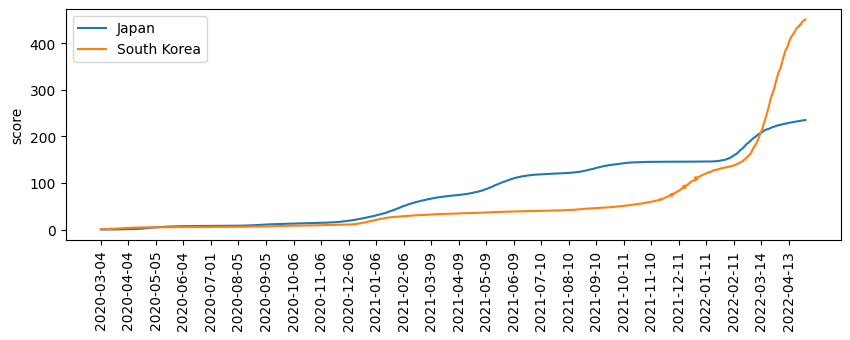

# hiscovid
hiscovid is a PyPI tool that calculates time transition scores for individual policies against COVID-19.

# How to install hiscovid
$ pip install hiscovid

# How to run hiscovid
$ hiscovid Japan 'South Korea'

